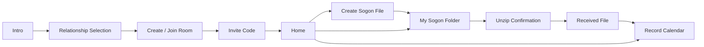

# Sogon.zip Figma Wireframe Spec

이 문서는 `README.md`와 `SOGONZIP.md` 기준으로 만든 모바일 앱 와이어프레임 스펙이다. 피그마에서는 `sogonzip-wireflow.svg`를 import한 뒤, 각 모바일 프레임을 390 x 844 기준 Auto Layout 화면으로 재구성하면 된다.

## Product Frame

- 서비스: 소곤.zip
- 핵심 약속: 조용히 저장한 취향이, 우리의 시간이 되는 곳.
- 핵심 UX 원칙: 파일은 정해둔 시점이 되어도 자동 공개되지 않고, 작성자의 마지막 확인 후 열린다.
- 톤: 따뜻함, private, file archive, 약간 retro, 실용적
- 기본 화면 크기: Mobile 390 x 844
- 기본 여백: 좌우 24, 섹션 간격 16-24, 하단 고정 CTA 영역 24

## Core Flow

1. Intro
2. Relationship Selection
3. Create or Join Room
4. Invite Code
5. Home
6. Create Sogon File
7. My Sogon Folder
8. Unzip Confirmation
9. Received File
10. Record Calendar

## Screen Notes

### 01 Intro

- Center logo object: folder/file archive icon
- Primary copy:
  - `소곤.zip`
  - `조용히 저장한 취향이, 우리의 시간이 되는 곳.`
  - `취향은 추천으로 풀리고, 마음은 정해둔 날에 열려요.`
- Bottom fixed CTA: `시작하기`

### 02 Relationship Selection

- Title: `누구와 소곤.zip을 시작할까요?`
- Two large choice cards:
  - `연인과 시작하기`
  - `친구와 시작하기`
- Each card has icon area, title, one-line helper text.

### 03 Create or Join Room

- Title: `소곤방 만들기`
- Input: nickname
- Primary CTA: `새 소곤방 만들기`
- Secondary CTA: `초대코드로 들어가기`

### 04 Invite Code

- Title: `상대방을 초대해주세요`
- Dashed code card: `A7K92`
- Actions:
  - `코드 복사하기`
  - `공유하기`
  - `나중에 초대하기`

### 05 Home

- Header:
  - D-day small text
  - `{nickname}의 소곤.zip`
- Main cards:
  - `오늘의 추천.zip`
  - `다가오는 소곤파일`
  - `최근 기록.zip`
- Dashed quick action: `새 소곤파일 만들기`
- Bottom nav: Home / Folder / Create

### 06 Create Sogon File

- Header: back + `새 소곤파일 만들기`
- Helper copy: `언젠가 알려주고 싶은 취향이나 마음을 조용히 저장해보세요.`
- Inputs:
  - Tag chips
  - Content textarea
  - Sensitivity selector
  - Opening timing select
  - Recommendation toggle
- Bottom fixed CTA: `소곤파일 저장하기`
- Important layout rule: `열리는 시점` and `추천에 반영하기` must be visually separate.

### 07 My Sogon Folder

- Header: back + `내 소곤폴더`
- Tabs:
  - `열릴 예정`
  - `열 준비됨`
  - `열림`
  - `닫아둠`
- File cards show:
  - tag/title
  - status badge
  - open timing
  - sensitivity
  - recommendation state
- Ready card CTA: `열기 확인하기`

### 08 Unzip Confirmation

- Header: `소곤파일 열기`
- Warning/helper copy:
  - `오늘 열 수 있는 소곤파일이에요`
  - `상대에게 보여주기 전에 마지막으로 확인해주세요.`
- File preview card shows private content to owner.
- Message textarea: optional message to send together.
- Bottom actions:
  - Primary: `오늘 열기`
  - Secondary: `수정하고 열기`
  - Safe options: `다음 기념일로 미루기`, `아직 닫아두기`

### 09 Received File

- Header: `받은 소곤파일`
- Opened state title: `새로운 소곤파일이 열렸어요`
- Message bubble from owner
- Opened file card
- Reaction grid:
  - `말해줘서 고마워`
  - `기억해둘게`
  - `귀엽다`
- Bottom CTA: `기록.zip에서 보기`

### 10 Record Calendar

- Header: `기록.zip`
- Calendar/month strip
- Timeline of opened files and reactions
- Empty state should feel warm, not like an error.

## Component Inventory

- App header with centered title and optional back icon
- Bottom navigation with 3 items
- Folder card
- Sogon file card
- `.zip` badge
- Status badge: locked / ready / opened / closed
- Tag chip
- Sensitivity selector
- Toggle row
- Dashed invite/code card
- Confirmation action sheet
- Reaction button
- Calendar record item

## Visual Tokens For Figma

- Background: cream white
- Primary: soft lavender
- Accent 1: pale yellow
- Accent 2: warm pink
- Accent 3: muted mint
- Text: dark navy or charcoal
- Stroke: soft gray
- Radius: 16 for inputs/buttons, 24 for large folder/file cards

## Figma Build Tips

- Import `sogonzip-wireflow.svg` as a visual reference board.
- Rebuild each phone frame as a Figma Frame named with the same screen number.
- Use Auto Layout vertically for every screen body.
- Make bottom CTAs fixed at the bottom for Create and Confirmation screens.
- Keep private-content states visually locked until owner confirmation.
- Avoid any copy or motion that implies automatic reveal.
