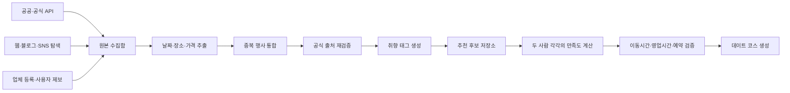

# 데이트 코스 추천 앱 데이터 최신화 전략

## 핵심 결론

인스타그램 전체를 크롤링해서 최신성을 유지하려는 전략은 적합하지 않다.

이 앱의 데이터 문제는 “모든 정보를 수집하는 문제”가 아니라 다음과 같은 구조로 해결해야 한다.

> 공공·공식 API로 기본 데이터를 확보하고, 검색·SNS로 새로운 후보를 발견한 다음, 실제 추천 직전에 핵심 정보만 다시 검증한다.

즉, 하나의 완벽한 API를 찾기보다는 **발견–정제–검증이 분리된 데이터 파이프라인**을 구축해야 한다.

---

## 1. 데이터 소스를 역할별로 나누기

| 역할 | 추천 소스 | 용도 |
|---|---|---|
| 행사·전시 기본 데이터 | TourAPI, 서울 문화행사, KOPIS, 문화포털 | 행사명, 기간, 장소, 가격 |
| 맛집·카페·주점 장소 정보 | 카카오 로컬, Google Places | 좌표, 카테고리, 영업시간, 폐업 여부 |
| 새 팝업·트렌드 발견 | 다음 웹·블로그 검색, 네이버 검색, 일부 Instagram API | 신규 후보 발굴 |
| 최종 사실 확인 | 공식 홈페이지, 예약 페이지, 주최자 페이지 | 날짜, 매진, 휴무, 예약 가능 여부 |
| 부족한 롱테일 데이터 | 업체 직접 등록, 사용자 제보 | 작은 팝업, 로컬 행사 |

### 1.1 한국관광공사 TourAPI

전국 관광지, 음식점, 문화시설, 축제·행사와 사진 정보를 제공한다. 전국 단위의 기본 데이터베이스를 만드는 데 유용하다.

- [한국관광공사 관광정보 Open API 목록](https://www.data.go.kr/tcs/dss/selectDataSetList.do?conditionType=init&keyword=%ED%95%9C%EA%B5%AD%EA%B4%80%EA%B4%91%EA%B3%B5%EC%82%AC&recmSe=N)
- [국문 관광정보 서비스 API 변경 안내](https://www.data.go.kr/bbs/ntc/selectNotice.do?originId=NOTICE_0000000004082)

### 1.2 서울시 문화행사 API

서울문화포털과 한국관광공사 기반 행사 정보를 제공한다. 서울 중심의 MVP를 만들 때 효율적이다.

- [서울 열린데이터광장](https://data.seoul.go.kr/)

### 1.3 KOPIS 공연예술통합전산망

연극, 뮤지컬, 클래식 등 공연과 공연시설 조회에 적합하다. 전시보다 공연 분야를 보강하는 데이터 소스로 활용할 수 있다.

- [KOPIS Open API 개발 가이드](https://kopis.or.kr/upload/openApi/%EA%B3%B5%EC%97%B0%EC%98%88%EC%88%A0%ED%86%B5%ED%95%A9%EC%A0%84%EC%82%B0%EB%A7%9DOpenAPI%EA%B0%9C%EB%B0%9C%EA%B0%80%EC%9D%B4%EB%93%9C.pdf)

### 1.4 카카오 로컬 API

맛집, 카페, 주점, 전시장 후보를 키워드·카테고리·위치 기준으로 검색할 수 있다. 장소 마스터와 이동 경로 계산의 중심으로 사용하기 좋다.

- [카카오 REST API 레퍼런스](https://developers.kakao.com/docs/ko/rest-api/reference)

### 1.5 Google Places API

장소 검색뿐 아니라 현재 영업시간, 임시 휴업·폐업 상태, 평점, 가격대, 다음 오픈·마감 시간 등을 얻을 수 있다.

유료이며 표시, 저장, 출처 표기 조건이 있으므로 모든 장소를 매일 갱신하기보다는 **사용자에게 추천하기 직전에 상위 후보만 검증하는 용도**가 적합하다.

- [Google Places API 개요](https://developers.google.com/maps/documentation/places/web-service/overview)
- [Google Places 데이터 필드](https://developers.google.com/maps/documentation/places/web-service/reference/rest/v1/places)

### 1.6 다음 웹·블로그 검색 API

`성수 팝업 8월`, `서울 참여형 전시`, `을지로 신규 주점`과 같은 질의를 최신순으로 검색해 새로운 후보를 발견하는 데 사용할 수 있다.

- [다음 검색 REST API](https://developers.kakao.com/docs/ko/daum-search/dev-guide)

### 1.7 네이버 검색 API

네이버 지역 검색은 반환 결과가 제한적이기 때문에 전체 장소 수집용보다는 장소 확인이나 보조 검색용으로 사용하는 것이 좋다. API 이관과 이용 정책도 개발 시점에 다시 확인해야 한다.

- [네이버 지역 검색 결과 제한 안내](https://developers.naver.com/notice/article/7528)
- [네이버 Developers 공지사항](https://developers.naver.com/notice/)

---

## 2. Instagram은 원본 데이터베이스가 아니라 레이더로 사용하기

Instagram 전체 크롤링은 다음과 같은 문제가 있다.

- 로그인, 차단, CAPTCHA 등의 이유로 수집기가 자주 깨질 수 있다.
- 게시물 작성일과 실제 행사 날짜가 다르다.
- 종료된 행사가 계속 검색된다.
- 하나의 팝업에 대한 게시물이 수십 개씩 중복된다.
- 이미지와 본문의 저작권 및 플랫폼 이용약관 문제가 생길 수 있다.
- 장소, 기간, 가격이 구조화되어 있지 않다.
- 공식 API도 일반 사용자 계정 전체를 자유롭게 검색하는 구조가 아니다.

Meta 공식 API는 주로 비즈니스·크리에이터 계정을 대상으로 한다. 일반 소비자 계정에 접근할 수 없고 검색 결과 정렬에도 제한이 있으므로, 서울의 최신 데이트 정보를 전부 가져오는 용도로 사용하기 어렵다.

- [Meta Instagram API 공식 컬렉션](https://www.postman.com/meta/instagram/documentation/6yqw8pt/instagram-api)

### 2.1 화이트리스트 계정 감시

모든 Instagram 게시물을 수집하려 하지 말고 다음과 같은 공식 계정 목록을 관리한다.

- 주요 백화점과 복합문화공간
- 전시관과 미술관
- 브랜드 팝업 운영사
- 지역 큐레이션 계정
- 공연장
- 티켓 판매처
- 성수·한남·연남·을지로 등 지역 상권 계정
- 이미 앱에 등록된 장소의 공식 계정

처음에는 100~300개 정도로 시작할 수 있다. 각 계정의 공식 홈페이지, 뉴스레터, 예약 페이지도 함께 저장한다.

게시물을 무단 복제하기보다는 다음 정보만 후보 데이터로 추출한다.

- 행사명
- 장소
- 시작일과 종료일
- 가격
- 예약 링크
- 공식 계정
- 원본 게시물 URL
- 발견 시각

추천에 노출하기 전에는 공식 페이지에서 다시 검증한다.

### 2.2 검색어 조합으로 신규 계정과 행사 발견

매일 지역 × 유형 × 시간 키워드 조합을 일부씩 순환 검색한다.

```text
성수 + 팝업 + 8월
한남 + 체험형 전시
홍대 + 이색 데이트
을지로 + 신규 오픈 + 주점
서울 + 원데이클래스 + 커플
잠실 + 팝업스토어 + 이번 주
```

모든 조합을 매번 검색할 필요는 없다. 사용자 수요가 많은 지역과 날짜에 검색 예산을 집중한다.

---

## 3. 최신성 관리 구조

데이터마다 변하는 속도가 다르므로 모두 같은 주기로 수집해서는 안 된다.

| 데이터 종류 | 권장 갱신 주기 |
|---|---|
| 7일 안에 시작·종료하는 팝업 | 3~6시간 |
| 한 달 안에 열리는 전시·공연 | 하루 1회 |
| 맛집·카페 기본 정보 | 2~4주 |
| 영업시간·휴무 | 추천 당일 또는 직전 |
| 매진·예약 가능 여부 | 추천 직전 |
| 종료된 행사 | 종료일 다음 날 숨김 처리 |
| 공식 페이지가 사라진 후보 | 보류 또는 관리자 검수 |

모든 항목에는 최신성과 출처를 추적할 수 있는 필드를 둔다.

```text
discovered_at       처음 발견한 시간
source_updated_at   원본에 표시된 수정 시간
verified_at         마지막으로 사실 확인한 시간
expires_at          다시 확인해야 하는 시간
event_start_at      행사 시작 시간
event_end_at        행사 종료 시간
status              예정 / 진행 / 종료 / 매진 / 확인 필요
confidence_score    정보 신뢰도
source_url          정보를 발견한 URL
official_url        주최자 또는 장소의 공식 URL
```

추천 가능 조건은 명시적인 규칙으로 관리한다.

```text
현재 시각 < event_end_at
AND confidence_score >= 0.7
AND verified_at이 데이터별 허용 기간 안에 있음
AND 폐업·취소 상태가 아님
```

사용자 화면에는 `오늘 확인됨`, `3일 전 확인됨` 같은 최신성 정보를 표시할 수 있다. 데이터가 완벽하지 않더라도 언제 확인한 정보인지 투명하게 보여주면 신뢰를 높일 수 있다.

---

## 4. 전체 데이터 파이프라인



### 중복 데이터 통합

중복 행사는 다음 요소를 조합해서 판단한다.

```text
정규화된 행사명
+ 장소 좌표
+ 날짜 구간 겹침
+ 주최자
```

Instagram 게시물 20개, 블로그 글 5개, 공식 페이지 1개가 같은 팝업을 가리키더라도 앱에는 하나의 이벤트만 보여야 한다. 이벤트 하나에 여러 출처 기록을 연결하는 구조가 좋다.

```text
event
 ├─ source_claim: 공식 홈페이지
 ├─ source_claim: 예약 페이지
 ├─ source_claim: Instagram 게시물
 └─ source_claim: 블로그 검색 결과
```

정보가 충돌할 때는 공식 홈페이지나 공식 예약 페이지의 우선순위를 가장 높게 둔다.

---

## 5. AI에게 맡길 일과 맡기지 말아야 할 일

### AI가 잘하는 일

- 게시물에서 날짜, 장소, 가격 후보 추출
- `감성적`, `체험형`, `사진 찍기 좋음` 같은 취향 태그 생성
- 비슷한 행사의 중복 후보 탐지
- 두 사람의 취향에 맞는 추천 설명 작성

### AI에게 최종 판단을 맡기면 안 되는 일

- 행사 종료일 확정
- 현재 영업 중인지 판단
- 예약 가능 여부 확정
- 가격 확정
- 공식 행사인지 확정

날짜와 운영 여부는 원문 근거와 함께 저장해야 한다. AI가 추출한 값에는 신뢰도와 근거 문자열을 함께 보관하는 것이 좋다.

### 취향 태그 예시

```json
{
  "mood": {
    "emotional": 0.9,
    "romantic": 0.7,
    "quiet": 0.4
  },
  "activity": {
    "hands_on": 0.85,
    "physical": 0.3,
    "creative": 0.8
  },
  "conversation": 0.7,
  "photo_friendly": 0.9,
  "indoor": true,
  "duration_minutes": 90,
  "price_per_person": 25000,
  "reservation_required": true
}
```

예를 들어 감성적인 활동을 좋아하는 사람과 체험형 활동을 좋아하는 사람이 함께 검색하면 `emotional`과 `hands_on` 점수가 모두 높은 참여형 미디어 전시, 공방, 향수 만들기 등이 상위 후보가 된다.

---

## 6. 두 사람의 취향 점수 계산

두 사람의 취향을 단순 평균내면 한 사람은 매우 좋아하지만 다른 사람은 싫어하는 코스가 추천될 수 있다.

```text
개인 A 만족도 = 취향 A와 장소 태그의 유사도
개인 B 만족도 = 취향 B와 장소 태그의 유사도

커플 만족도 =
0.5 × min(A, B)
+ 0.3 × sqrt(A × B)
+ 0.2 × 시너지 점수
```

`min(A, B)`를 반영하면 둘 중 한 명이 싫어할 가능성이 높은 코스를 억제할 수 있다.

장소 검색 전에는 다음과 같은 조건을 먼저 적용한다.

- 두 사람의 예산
- 이동 가능 거리
- 가능한 시간
- 음주 가능 여부
- 실내·실외 선호
- 예약 가능 여부
- 음식 알레르기
- 대화가 중요한 데이트인지
- 허용 가능한 활동 강도

---

## 7. 장소 추천이 아닌 데이트 코스 만들기

장소별 점수만 높은 후보를 나열해서는 좋은 데이트 코스가 만들어지지 않는다.

예시는 다음과 같다.

```text
참여형 전시
→ 도보 12분
→ 감성 카페
→ 도보 8분
→ 조용한 주점
```

장소 개별 점수가 높더라도 서로 50분 떨어져 있다면 좋은 코스가 아니다. 코스를 생성할 때 다음 정보를 함께 계산해야 한다.

- 이동시간
- 예상 체류시간
- 각 장소의 영업시간
- 행사 시작과 종료 시간
- 예약 시간
- 식사 시간
- 날씨와 실내·실외 여부
- 사용자가 원하는 데이트 총시간

추천 시스템 내부에서는 장소를 노드로, 이동 가능성을 간선으로 표현한 코스 그래프를 사용할 수 있다.

---

## 8. 현실적인 MVP 전략

처음부터 전국 데이터를 수집하지 않고 서울의 핵심 지역부터 시작한다.

### 1단계: 서울 핵심 지역

- 성수
- 한남
- 연남·홍대
- 을지로
- 잠실
- 강남·신사

초기 데이터 소스는 다음 정도로 제한한다.

- TourAPI
- 서울 문화행사 API
- KOPIS
- 카카오 로컬 API
- 다음 웹·블로그 검색 API
- 공식 운영사·공간 화이트리스트 약 100개
- 관리자 직접 등록 화면

### 2단계: 추천 직전 검증

사용자가 토요일 성수 데이트를 요청한다고 가정한다.

1. 성수 주변 후보 50개를 조회한다.
2. 두 사람의 취향과 제약 조건으로 10개까지 줄인다.
3. 상위 10개의 영업시간, 종료일, 예약 여부만 다시 확인한다.
4. 실제 이동 가능한 코스 3개를 생성한다.

이 방식을 사용하면 전국 모든 장소를 매일 검증할 필요가 없다.

### 3단계: 공급자가 직접 업데이트하는 구조

장기적으로 가장 강력한 최신화 방법은 크롤링이 아니라 업체와 주최자의 직접 등록이다.

- 팝업 무료 등록
- 공식 운영자 인증
- 행사 수정 링크 제공
- 앱에서 발생한 클릭·예약 통계 제공
- 종료·매진 상태 변경 기능
- 노출을 원하는 업체에 우선 업데이트 권한 제공

사용자에게도 다음과 같은 제보 기능을 제공한다.

- 폐업함
- 오늘 휴무임
- 이미 매진됨
- 일정이나 가격이 다름
- 장소가 잘못 표시됨

신뢰도 높은 신고가 쌓이면 자동으로 추천에서 일시 제외하고 관리자 검수 대상으로 전환할 수 있다.

---

## 9. 최종 권장 원칙

- **API는 기본 데이터를 만든다.**
- **검색과 SNS는 신규 후보를 발견한다.**
- **공식 사이트와 예약 페이지는 사실을 확인한다.**
- **업체와 사용자는 최신화를 보완한다.**
- **AI는 정보 추출, 중복 탐지, 취향 태깅을 담당한다.**
- **추천 직전 검증으로 비용을 절약한다.**
- **모든 정보에 신뢰도와 마지막 확인 시각을 표시한다.**

가장 중요한 제품 원칙은 다음과 같다.

> “서울의 모든 이벤트를 보유한 앱”보다 “지금 실제로 갈 수 있다고 믿을 수 있는 20개를 보여주는 앱”이 더 가치 있다.

초기에는 데이터의 양보다 **추천 가능한 상태를 정확히 판별하는 시스템**에 집중하는 것이 좋다.

